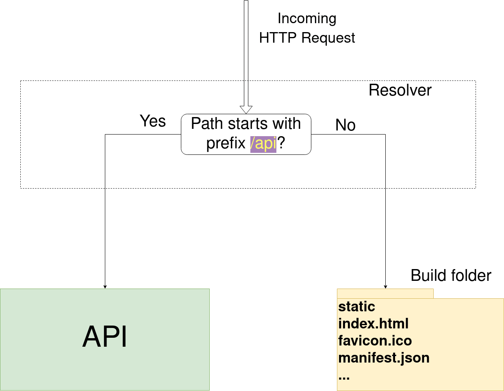
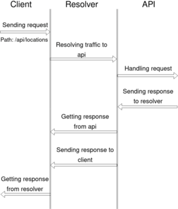

# FB TRAFFIC RESOLVER
<p align="center">
    
</p>

# 📓 About
FB (frontend and backend) traffic resolver is a simple program that
(as name suggests) resolves traffic based on the path of requesting url.

# ❓ Motivation
Sometimes developers want to make a proxy pass. So, they want to go to /api path on frontend and get access to handlers of backend API. One of the most common solution is, of course, to use nginx. Nginx is a great tool! But if a developer wants to have a dynamic interpolation to nginx.conf in a proxy pass section then it turns out that nginx doesn't support environment variables out-of-the-box. So, you could use Lua plugin for nginx, `envsubst` command and more. But the task is simple, just to substitute BACKEND_API variable in the proxy pass section in nginx.conf. That's why fb traffic resolver was created. Its goal to simplify linking between frontend and backend.

# 💡 How does fb traffic resolver work?
Here's a scheme:



When incoming request gets to resolver, the program compares the path of url in request
to the path "/api".
If they are equal then the traffic will be resolved to API otherwise to
build folder that contains all stuff that is necessary for frontend.
By the way, we've mentioned "build folder". Actually, it's the product of
the following command:
```bash
npm run build
```
Hence, by "build folder" we simply mean built frontend project that is ready
for production.

To link all the things together you basically need:
1) Running resolver in Docker container
2) Build folder copied to the Docker container with resolver
3) Running backend API in Docker container

Here's another scheme that describes detailed interplay between resolver
and API:


Traffic will be resolved to API only if path in a request URL matches the
template `/api*`. The client on the scheme is a Javascript (js) code
running in browser.
Assume that there's a frontend developer Alan that has to get data from API.
For the route `/locations` in react app he gets data using the url `/api/locations`:
```js
fetch("/api/locations",
    {
        method: 'GET',
    }
);
```

Alan specifies ports 80:80 for Docker container with
resolver and build folder. He runs the whole app with `docker compose up --build`.
Then, Alan goes to `http://localhost/locations`, he sees amazing frontend page with html, css and js.
The js code calls `/api/locations` and the final url is `http://localhost/api/locations`. This request goes to 
traffic resolver that resolves traffic to the container with backend API.
Backend API handles the request: retrieving locations from db, for instance.
And then, sends response back to the traffic resolver. After this, traffic resolver sends
locations to the client (js code in browser), so there will be a data about locations on frontend.

# 🕹️ Demo
See [the demo of the workflow described above](https://github.com/GonnaFlyMethod/fb-traffic-resolver-demo).

# 🐋 Docker-hub
Here's [the page of FB-Traffic resolver on docker-hub](https://hub.docker.com/repository/docker/gonnaflymethod/fb-traffic-resolver/general) 

# 📑 License
This project is licensed under the MIT License - see the 
[LICENSE.md](https://github.com/GonnaFlyMethod/fb-traffic-resolver/blob/main/LICENSE) file for 
details.

# ❤️ Attribution
The favicon(internal/testdata/build/favicon.ico) was taken from [www.flaticon.com](https://www.flaticon.com/free-icon/google_2913965).

[Other google icons on flaticon](https://www.flaticon.com/free-icons/google)

